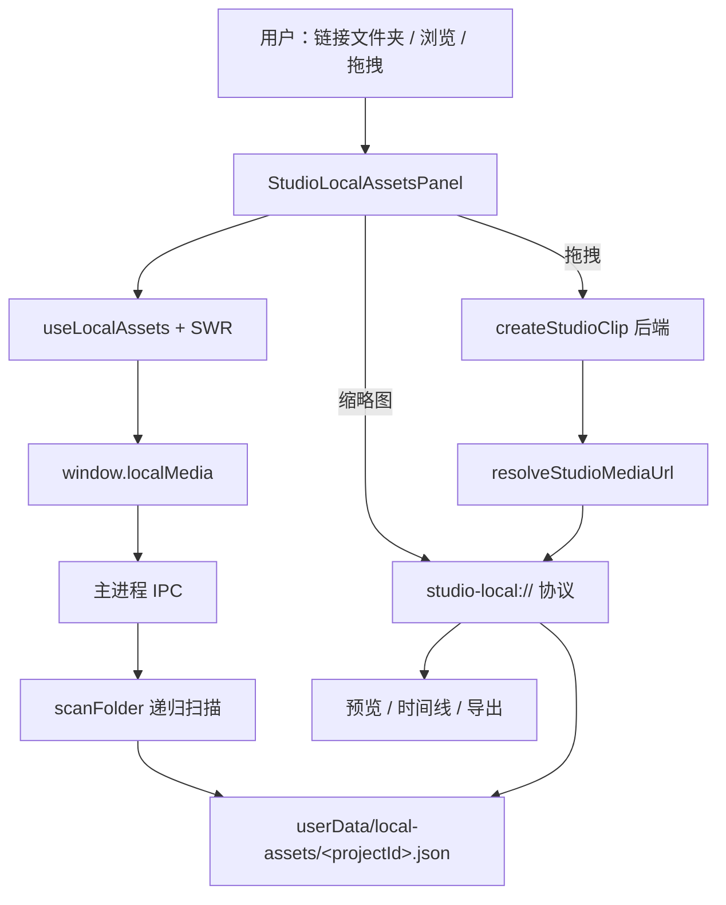

# 本地文件夹与资源管理 — 实现说明

> 本文说明「链接本地文件夹」与「本地资源管理」在 Electron Studio 中的实现方式。  
> **注意**：此功能**不是**把文件夹上传到服务器，而是本机目录索引 + 自定义协议读盘 + 后端仅存 clip 引用。

---

## 1. 概念澄清

| 说法 | 实际行为 |
|------|----------|
| 链接文件夹 | Electron 目录对话框 → 主进程递归扫描 → 写入本地 JSON 索引 |
| 资源管理 | 左侧面板展示索引中的图片/视频，预览走 `studio-local://` |
| 拖到时间线 | 调用后端 `createStudioClip`，`object_key` 为 `studio-local:<assetId>`，**文件仍在本机** |
| 时间线「上传」 | 另一条链路：文件上传到 R2，与本地资源库无关 |

---

## 2. 整体数据流



一句话：**链接文件夹 → Electron 建索引；拖入时间线 → 后端建 clip；播放 → 本地协议读盘。**

---

## 3. 链接文件夹（非上传）

### 3.1 UI 入口

- 左侧竖条工具：`toolMode === "local"`（`FolderOpen` 图标）
- 面板：`StudioLeftPanel` → `StudioLocalAssetsPanel`
- 按钮：「链接本地文件夹」/「更换本地文件夹」

相关文件：

- `src/renderer/src/components/studio/StudioEditorClient.tsx` — 竖条 `["local", FolderOpen, ...]`
- `src/renderer/src/components/studio/layout/StudioLeftPanel.tsx` — `toolMode === "local"` 时渲染面板
- `src/renderer/src/components/studio/resources/StudioLocalAssetsPanel.tsx`

### 3.2 调用链

1. **`pickFolder()`**（`useLocalAssets.ts`）
   - `window.localMedia.pickFolder()` → IPC `local-media:pick-folder`
   - 主进程 `dialog.showOpenDialog({ properties: ['openDirectory'] })`

2. **`setLocalMediaFolder(projectId, folderPath)`**
   - IPC `local-media:set-folder`
   - `scanLocalMediaFolder(folderPath)` 递归扫描
   - `replaceLocalAssets(projectId, folderPath, assets)` 写入 store

3. **SWR `mutate`** 刷新列表，网格展示素材。

### 3.3 扫描规则（`scanFolder.ts`）

- **图片**：`jpg` `jpeg` `png` `webp` `gif`
- **视频**：`mp4` `mov` `webm` `m4v`
- 子目录递归；非媒体扩展名跳过
- 每条记录含：`absolutePath`、`relativePath`、`mediaType`、`size`、`mtimeMs`
- **`id`**：`SHA1(absolutePath).slice(0, 16)`（同路径 id 稳定）

视频时长**不在主进程读取**，由 renderer 用 `<video preload="metadata">` 或拖入时间线时读取。

---

## 4. 资源管理

### 4.1 列表加载

- Hook：`src/renderer/src/lib/studio/localAssets/useLocalAssets.ts`
- SWR key：`["studio-local-assets", projectId]`
- IPC `local-media:list` → 读 JSON，并为每条 asset 附加 `exists: existsSync(absolutePath)`

### 4.2 持久化（`localAssetStore.ts`）

- 路径：`app.getPath("userData")/local-assets/<projectId>.json`
- 结构：`{ folderPath, assets[] }`
- **每个项目只保留一个文件夹**；再次链接会**整表替换**
- API：`list` / `get` / `replaceLocalAssets` / `setDuration`

### 4.3 预览 URL（`studio-local://`）

浏览器不能长期依赖暴露真实磁盘路径，因此使用自定义协议：

| 步骤 | 说明 |
|------|------|
| 注册 | `src/main/index.ts` 注册特权 scheme `studio-local` |
| 处理 | `localProtocol.ts`：`protocol.handle` 根据 URL 中的 `assetId` 查 store |
| 读盘 | `net.fetch(pathToFileURL(absolutePath))` |
| CORS | 响应头 `Access-Control-Allow-Origin: *`，避免 canvas 导出被污染 |

Renderer 侧：

- `localAssetUrl.ts`：`studio-local:<id>` ↔ `studio-local://<id>`
- `resolveStudioMediaUrl.ts`：clip 的 `object_key` / `media_url` 识别 `studio-local:` 前缀后转为协议 URL

资源面板缩略图：`` / `<video preload="metadata">`。

### 4.4 Preload 桥接

`src/preload/index.ts` 暴露 `window.localMedia`：

| 方法 | IPC |
|------|-----|
| `pickFolder()` | `local-media:pick-folder` |
| `setFolder(projectId, path)` | `local-media:set-folder` |
| `list(projectId)` | `local-media:list` |
| `get(projectId, assetId)` | `local-media:get` |
| `setDuration(projectId, assetId, sec)` | `local-media:set-duration` |

Renderer 封装：`localAssetsApi.ts`。

### 4.5 拖拽到时间线

1. **`localAssetDrag.ts`**：`onDragStart` 写入自定义 MIME + payload（`assetId`、`name`、`mediaType`、`durationSec` 等）
2. **`StudioTimeline.tsx`**：`onDragOver` / `onDrop`，按落点算 `startSec`、目标 `trackId`
3. **`createLocalAssetClip.ts`**：
   - `getLocalMediaAsset` 校验 `exists`
   - 视频无 `durationSec`：隐藏 `<video>` 读 metadata → `set-duration` 写回 store
   - `createStudioClip`：`source_type: "upload"`，`object_key: "studio-local:<assetId>"`
   - 若目标轨道与默认不同 → `updateStudioClip` 改 `track_id`

### 4.6 缺失文件

- **资源面板**：`exists === false` → 置灰、不可拖
- **时间线**：`parseLocalAssetObjectKey` 得到本地 clip，IPC `get` 失败 → 红色块 + tooltip

再次链接文件夹会替换映射；若新目录内仍有**相同绝对路径**（同 hash id），旧 clip 仍可解析。

---

## 5. 与「时间线上传」对比

| | 本地文件夹资源库 | 时间线工具栏上传 |
|--|------------------|------------------|
| 入口 | 左侧「本地」面板 | 时间线 Upload |
| 文件去向 | 留在本机 | 上传到 R2 |
| clip 引用 | `object_key: studio-local:<id>` | 公网 URL / R2 key |
| 实现 | `createLocalAssetClip` + 本地协议 | `uploadStudioClip` / `getUploadUrl` |

两条链路并存，互不替代。

---

## 6. 设计决策摘要

| 点 | 决策 |
|---|---|
| 文件存储 | 媒体不上传 R2，仅本机路径索引 |
| 创建 clip | 仍走后端 `createStudioClip`，刷新后可恢复 |
| `source_type` | 复用 **`upload`**（不新增 `local_file`） |
| `object_key` | `studio-local:<assetId>` |
| 项目绑定 | 每项目一个本地文件夹 |
| 安全 | 协议只返回 store 中登记过的路径，防任意读盘 |

---

## 7. 创建 clip 请求示例

```ts
await createStudioClip(projectId, {
  source_type: "upload",
  media_type: "video", // 或 "image"
  object_key: "studio-local:<assetId>",
  start_sec: 10,
  duration_sec: 12,           // 视频 clamp(1, 60)，图片默认 3
  source_duration_sec: 18.2,  // 视频可选
  aspect_ratio: "16:9",
  title: "shot_001.mp4",
});
```

---

## 8. 关键文件一览

### 主进程

| 文件 | 职责 |
|------|------|
| `src/main/localMedia/scanFolder.ts` | 递归扫描媒体文件 |
| `src/main/localMedia/localAssetStore.ts` | JSON 持久化、id 生成、exists |
| `src/main/localMedia/localProtocol.ts` | `studio-local://` 协议处理 |
| `src/main/localMedia/ipc.ts` | IPC 注册 |
| `src/main/index.ts` | scheme + 协议 + IPC 入口 |

### Preload

| 文件 | 职责 |
|------|------|
| `src/preload/index.ts` | `window.localMedia` |
| `src/preload/index.d.ts` | 类型声明 |

### Renderer

| 文件 | 职责 |
|------|------|
| `lib/studio/localAssets/types.ts` | 类型 |
| `lib/studio/localAssets/localAssetsApi.ts` | IPC 封装 |
| `lib/studio/localAssets/useLocalAssets.ts` | SWR + `pickFolder` |
| `lib/studio/localAssets/localAssetUrl.ts` | object_key / 协议 URL |
| `lib/studio/localAssets/localAssetDrag.ts` | 拖拽 payload |
| `lib/studio/localAssets/createLocalAssetClip.ts` | 创建 clip |
| `components/studio/resources/StudioLocalAssetsPanel.tsx` | 资源 UI |
| `components/studio/layout/StudioLeftPanel.tsx` | 左栏 `local` 模式 |
| `components/studio/timeline/StudioTimeline.tsx` | 拖放 + 缺失检测 |
| `lib/studio/resolveStudioMediaUrl.ts` | 统一 URL 解析 |

### 国际化

`src/renderer/src/lib/i18n/translations.ts`：`studioLocalAssets*`、`studioTimelineLocalAssetSuccess` 等。

---

## 9. 后续可选

- 后端增加 `source_type: "local_file"`，语义更清晰
- 每项目支持多个文件夹
- 主进程 ffprobe 预读视频时长
- 扫描进度 UI（大目录）

---

*更完整的开发记录见 `开发日记.md`（2026-05-22 本地文件夹资源库）。*
