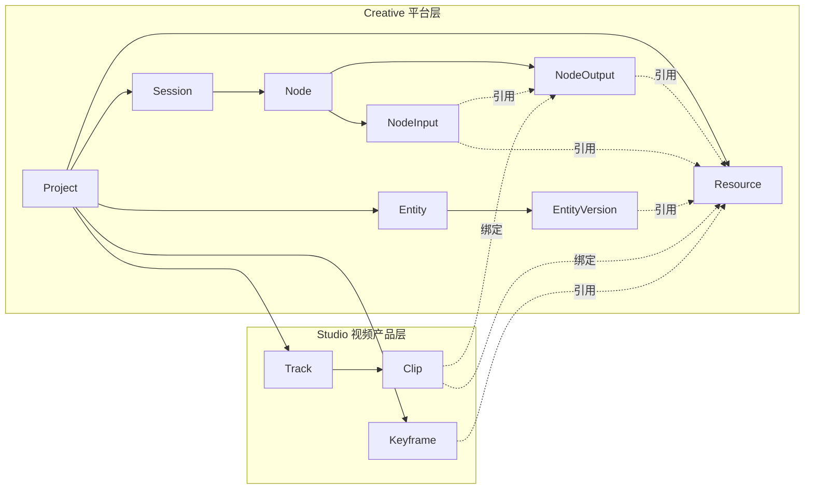
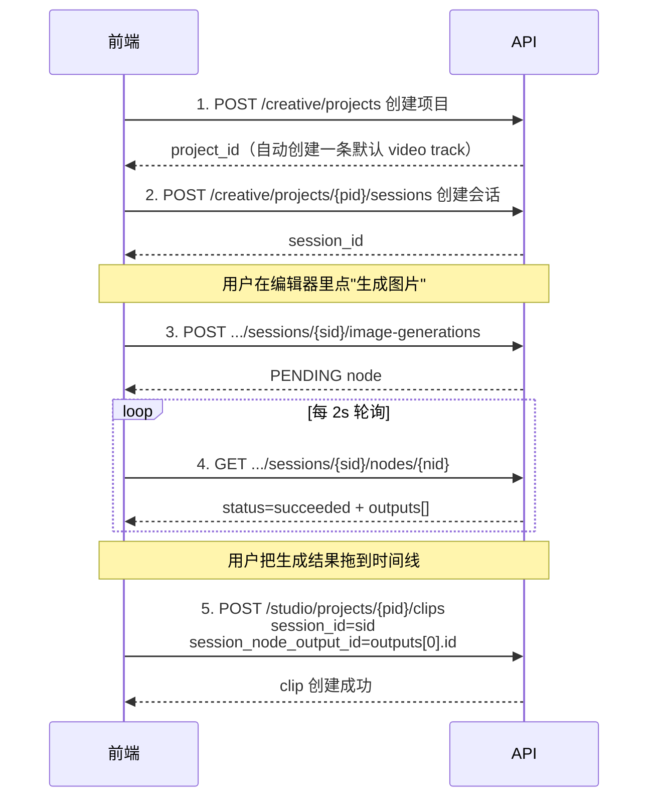
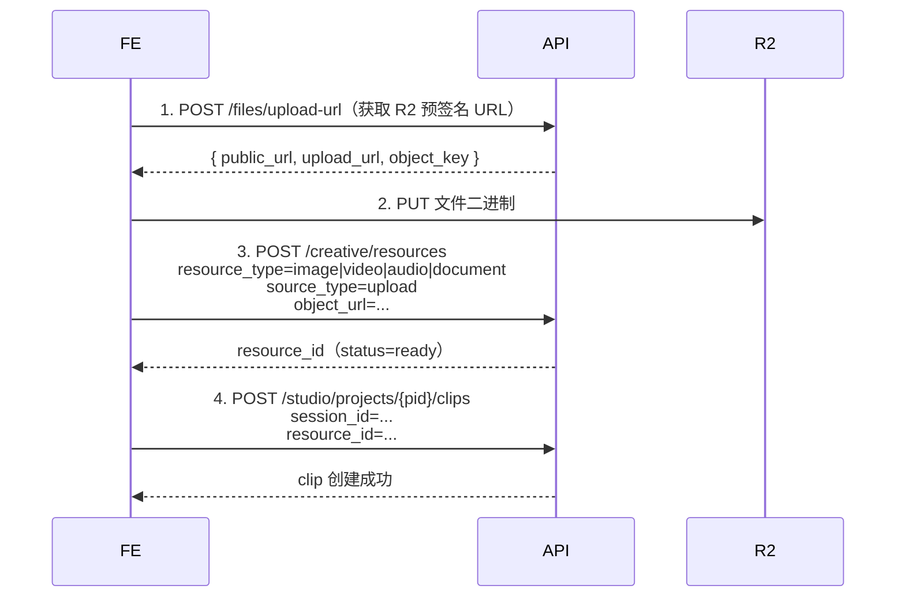
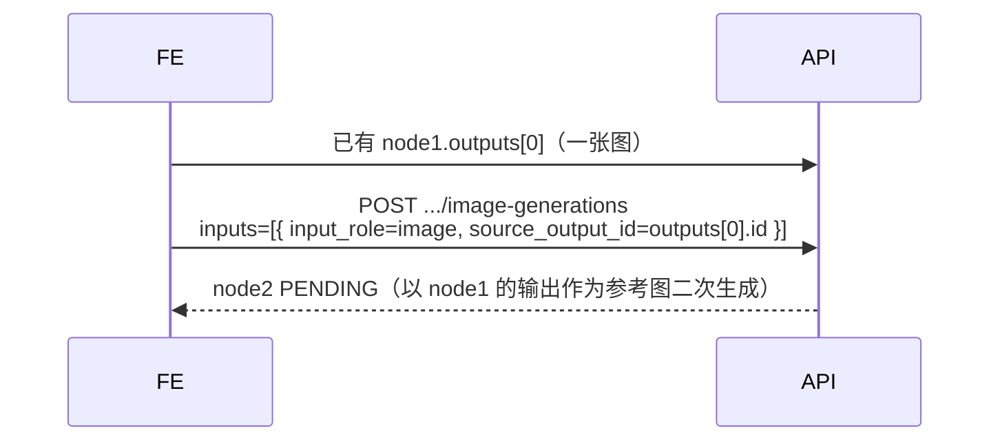
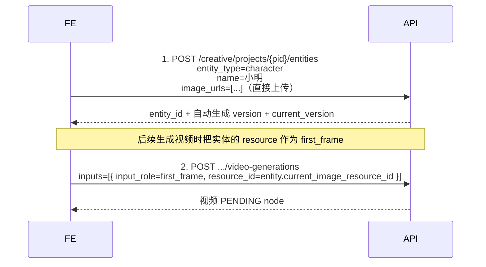

# Studio API 前端接入指南

> 面向前端 / 客户端开发者的 **Creative 平台 + Studio 视频产品** 完整使用文档。
>
> 本期重构后，后端按"AI 创作平台 + 视频编辑产品"双层组织，路径前缀分别是：
>
> - `/api/v1/creative/...` — Creative 平台层（Project / Resource / Session / Node / Entity）
> - `/api/v1/studio/...` — Studio 视频产品层（Track / Clip / Keyframe）
>
> 鉴权方式与全站一致：`Authorization: Bearer <jwt>`。
>
> **统一响应结构**：所有接口返回 `{ code, msg, data }`，前端**只看 `code` 字段**判断结果：`code === 0` 成功，其它都是业务错误码（参见末尾错误码表）。

## 目录

- [一、整体架构（双层模型）](#一整体架构双层模型)
- [二、标准工作流（强烈建议先读）](#二标准工作流强烈建议先读)
- [三、URL 与对象存储规则（必读）](#三url-与对象存储规则必读)
- [四、AI 模型列表](#四ai-模型列表)
- [五、Creative 项目（Project）](#五creative-项目project)
- [六、Creative 资源（Resource）](#六creative-资源resource)
- [七、Creative 会话（Session）](#七creative-会话session)
- [八、Creative AI 生成 ① 文本生成](#八creative-ai-生成--文本生成)
- [九、Creative AI 生成 ② 图片生成](#九creative-ai-生成--图片生成)
- [十、Creative AI 生成 ③ 视频生成](#十creative-ai-生成--视频生成)
- [十一、Creative 节点通用接口](#十一creative-节点通用接口)
- [十二、Creative 实体（Entity）](#十二creative-实体entity)
- [十三、Creative 实体版本（Entity Version）](#十三creative-实体版本entity-version)
- [十四、Studio 时间线轨道（Track）](#十四studio-时间线轨道track)
- [十五、Studio 时间线 Clip](#十五studio-时间线-clip)
- [十六、Studio 关键帧（Keyframe）](#十六studio-关键帧keyframe)
- [十七、异步轮询契约](#十七异步轮询契约)
- [十八、错误码表](#十八错误码表)
- [十九、附录：常见排查清单](#十九附录常见排查清单)

---

## 一、整体架构（双层模型）



### 1.1 核心实体说明

| 实体 | 所属层 | 说明 | 关键属性 |
|------|------|------|---------|
| **Project** | Creative | 一个创作项目（视频项目 / 剧本 / Agent / Chat / 通用 AI 工具均可） | `id`, `project_type`, `title`, `aspect_ratio` |
| **Resource** | Creative | **统一资源池**（image/video/audio/text/document） | `id`, `resource_type`, `source_type`, `object_url`/`text_content`, `status` |
| **Session** | Creative | AI 创作会话，是 Node 容器，相当于一段创作上下文 | `id`, `session_type`, `title` |
| **Node** | Creative | 一次 AI 任务（文本/图片/视频生成等） | `id`, `node_type`, `status`, `inputs[]`, `outputs[]` |
| **NodeInput** | Creative | 节点输入：`resource_id` / `source_output_id` / `text_content` 三选一 | `input_role`, `resource_id`, `source_output_id`, `text_content` |
| **NodeOutput** | Creative | 节点产物，**通过 `resource_id` 指向 Resource** | `output_role`, `resource_id` |
| **Entity** | Creative | 项目内可复用的人物 / 场景 / 道具 / 风格 | `entity_type`, `name`, `current_version_id`, `parent_id` |
| **EntityVersion** | Creative | 实体的一次生成 / 上传快照 | `prompt`, `model`, `resource_id`, `status` |
| **Track** | Studio | 视频时间线上的一条轨道 | `track_type`, `sort_order`, `is_muted`, `is_locked` |
| **Clip** | Studio | 轨道上的一个片段，**绑定 session_id** + node output / resource / 纯文本 | `clip_type`, `start_sec`, `duration_sec`, `media_url`, `transform` |
| **Keyframe** | Studio | 项目级图片资源池（首尾帧 / 截屏） | `source_type`, `usage_type`, `resource_id` |

### 1.2 三条铁律

1. **所有"图片 / 视频 / 文本 / 音频"统一进 Resource 表**。上传产物、生成产物、上传文件都登记在 `creative_resources`，下游通过 `resource_id` 引用。
2. **Node 的 inputs 是引用**（不复制）：删除被引用的 Resource / NodeOutput 不会硬删除，业务层走软删除保留绑定。
3. **Clip 必须绑定一个 session_id**：clip 是时间线上的视图，session 是创作上下文，删 session 时若仍被 clip 引用会被拒。

### 1.3 实体生命周期

```text
Project
 ├── Resource（上传 / 生成产物，全部进资源池）
 ├── Session
 │    └── Node（text_generation / image_generation / video_generation / ...）
 │         ├── NodeInput → Resource | NodeOutput | text_content
 │         └── NodeOutput → Resource
 ├── Entity（character / scene / prop / style）
 │    └── EntityVersion → Resource
 ├── Track（Studio 独有）
 │    └── Clip → session_id + (NodeOutput | Resource | text_content)
 └── Keyframe（Studio 独有）→ Resource
```

---

## 二、标准工作流（强烈建议先读）

下面是**完整的项目生命周期**，绝大多数前端流程都是这套：

### 流程 A：从零开始做一个视频项目



### 流程 B：用户直接导入素材到时间线



### 流程 C：基于已生成结果继续二次创作（链式生成）



### 流程 D：先建实体（角色 / 场景 / 风格），后续作为参考图



---

## 三、URL 与对象存储规则（必读）

### 3.1 object_key vs public URL

- **object_key**：R2 对象存储里的相对路径，如 `creative/users/123/images/abc.png`。**数据库只存这个**。
- **public URL**：完整 HTTPS 链接，如 `https://cdn.example.com/creative/users/123/images/abc.png`。**前端展示用这个**。

### 3.2 接口约定

| 场景 | 传哪个 | 说明 |
|------|-------|------|
| **请求体**（`object_url` / `image_urls` / `cover_url` 等字段） | **两个都行**：传完整 URL 或 object_key | 后端会自动把 URL 转成 object_key 入库 |
| **响应体**（`object_url` / `cover_url` / `media_url` / `image_url` 等 URL 字段） | 后端**永远返回完整 public URL** | 前端直接用，不需要再拼 |

### 3.3 上传流程（统一）

```text
POST /api/v1/files/upload-url
{ "purpose": "ai_resource_image", "filename": "scene.png", "content_type": "image/png" }
↓
返回 { "upload_url", "public_url", "object_key", "expires_in" }
↓
前端 PUT upload_url（直传 R2，不经过后端）
↓
两条路径任选其一：
 (1) POST /creative/resources 显式登记 → 拿到 resource_id 后续可复用（推荐"素材库"场景）
 (2) 直接在业务接口（创建 clip / 关键帧 / 实体版本 / 项目封面）里传 object_url → 后端事务内部自动登记
```

**当前支持的 `purpose`**（`ai_resource_*` 系列对应 Creative 平台四类资源）：

| purpose | object_key 前缀 | 允许扩展名 | 允许 Content-Type | 分片上传 |
|---|---|---|---|---|
| `ai_resource_image` | `ai/{uid}/images` | `png / jpg / jpeg / gif / webp` | `image/png` `image/jpeg` `image/gif` `image/webp` | 否 |
| `ai_resource_video` | `ai/{uid}/videos` | `mp4 / mov` | `video/mp4` `video/quicktime` | 是 |
| `ai_resource_audio` | `ai/{uid}/audios` | `mp3 / wav / m4a / aac / ogg / flac / opus` | `audio/mpeg` `audio/wav` `audio/x-wav` `audio/mp4` `audio/x-m4a` `audio/mp4a-latm` `audio/aac` `audio/x-aac` `audio/ogg` `audio/flac` `audio/x-flac` `audio/opus` | 是（无损大文件） |
| `ai_resource_document` | `ai/{uid}/documents` | `pdf / doc / docx / txt / ppt / pptx / xls / xlsx / csv / md` | `application/pdf` `application/msword` `application/vnd.openxmlformats-officedocument.*` `application/vnd.ms-*` `text/plain` `text/csv` `text/markdown` | 否 |

> **写入入口仅 `POST /creative/resources`**（仅上传文件场景，仅限 image / video / audio / document）。`PUT` / `DELETE` 接口不开放；前端如需复用同一个文件，请保存返回的 `resource_id`。
>
> 小文件（mp3 / aac / opus 等压缩音频，pdf / txt 等文档）走单次 PUT；无损大音频（wav / flac > 100MB）建议走 `POST /files/multipart/init` 分片上传。

---

## 四、AI 模型列表

`GET /api/v1/creative/ai/models`

可选 query：`?type=text|image|video` 只拉某一类。

### 响应

```json
{
  "code": 0,
  "data": {
    "text_models": [
      {
        "id": "gemini-2.5-pro",
        "name": "gemini-2.5-pro",
        "kind": "text",
        "supported_aspect_ratios": ["1:1","16:9","9:16","4:3","3:4","3:2","2:3","21:9"],
        "supported_image_sizes": [],
        "supported_durations": []
      }
    ],
    "image_models": [
      {
        "id": "gemini-3-pro-image-preview",
        "name": "gemini-3-pro-image-preview",
        "kind": "image",
        "supported_aspect_ratios": ["1:1","16:9","9:16","4:3","3:4","3:2","2:3","21:9"],
        "supported_image_sizes": ["1K","2K","4K"],
        "supported_durations": []
      }
    ],
    "video_models": [
      {
        "id": "kling/kling-v3-omni-video-generation",
        "name": "kling/kling-v3-omni-video-generation",
        "kind": "video",
        "supported_aspect_ratios": ["1:1","16:9","9:16"],
        "supported_image_sizes": [],
        "supported_durations": [3,4,5,6,7,8,9,10,11,12,13,14,15]
      }
    ]
  }
}
```

### 当前内置模型清单

| 分类 | 模型 ID |
|------|---------|
| 文本（text） | `gemini-2.5-pro`, `gemini-2.5-flash`, `gemini-3.1-pro-preview`, `gemini-3.1-flash-lite-preview`, `gemini-3-flash-preview` |
| 图片（image） | `gemini-2.5-flash-image`, `gemini-3-pro-image-preview`, `gemini-3.1-flash-image-preview` |
| 视频（video） | `kling/kling-v3-video-generation`, `kling/kling-v3-omni-video-generation`, `seedance`, `seedance-fast` |

> 可灵 v3：比例 `1:1` / `16:9` / `9:16`；时长 3~15 秒；含视频输入时建议 3~10 秒；清晰度见 `params.providers.kling.parameters.mode`（`std`=720P，`pro`=1080P）。  
> Seedance（Token100）：比例另支持 `adaptive`；时长 4~15 秒；清晰度见 `params.providers.seedance.resolution`——`seedance` 支持 `480p`/`720p`/`1080p`，`seedance-fast` 仅 `480p`/`720p`。

### 4.1 Creative AI 参数约定（`params.providers`）

文本 / 图片 / 视频生成统一使用：

```json
{
  "params": {
    "providers": {
      "<gemini|kling|seedance>": { }
    }
  }
}
```

- 每次请求 **只允许一个** 与 `model` 匹配的 provider key。
- 一等字段（`prompt`、`aspect_ratio`、`duration_sec` 等）不得放入 `providers`。
- 旧字段 `params.provider_params` 仍兼容（自动映射到 `gemini` 或 `kling`），新接入请使用 `providers`。

**输入级** `inputs[i].params`：仅可灵 `input_role=video` 支持 `keep_original_sound`；Seedance MVP 不支持 `inputs[].params`。

**视频分辨率速查**（不得作为顶层字段，须放入 `params.providers`）：

| 模型 | 传参路径 | 可选值 | 默认 |
|------|----------|--------|------|
| `kling/kling-v3-*` | `params.providers.kling.parameters.mode` | `std`（720P）/ `pro`（1080P） | 百炼上游 `pro` |
| `seedance` | `params.providers.seedance.resolution` | `480p` / `720p` / `1080p` | `720p` |
| `seedance-fast` | 同上 | `480p` / `720p`（**无 1080p**） | `720p` |

切换模型时前端分辨率控件须联动；需要 1080P 可选可灵 `mode: "pro"` 或 Seedance 标准版 `resolution: "1080p"`。详见 [10.8.1 视频分辨率](#1081-视频分辨率按供应商)。

---

## 五、Creative 项目（Project）

### 5.1 项目类型（project_type）

| 值 | 说明 |
|---|------|
| `studio` | Studio 视频编辑项目（默认） |
| `script` | 剧本项目 |
| `agent` | Agent 项目 |
| `tool` | AI 工具项目 |
| `chat` | 对话项目 |

> 当前 Studio 前端默认创建 `studio` 类型。其它类型为后续扩展预留。

### 5.2 创建项目

`POST /api/v1/creative/projects`

```json
{
  "title": "我的新项目",
  "description": "可选描述",
  "project_type": "studio",
  "cover_url": "https://cdn.example.com/covers/xxx.png",
  "aspect_ratio": "16:9",
  "settings": {"theme": "dark"}
}
```

| 字段 | 必填 | 说明 |
|------|------|------|
| `title` | 是 | 1~200 字符 |
| `description` | 否 | ≤5000 字符 |
| `project_type` | 否 | 默认 `studio` |
| `cover_url` | 否 | 可传 public URL 或 object_key；后端会自动登记 cover Resource |
| `aspect_ratio` | 否 | 默认 `16:9`，可选：`1:1` / `16:9` / `9:16` / `4:3` / `3:4` / `3:2` / `2:3` / `21:9` |
| `settings` | 否 | 项目级 JSON 扩展配置 |

> 创建 `project_type=studio` 项目后，**后端自动追加一条默认 video Track**。

### 5.3 项目响应

```json
{
  "code": 0,
  "data": {
    "id": 101,
    "user_id": 9,
    "project_type": "studio",
    "title": "我的新项目",
    "description": null,
    "cover_resource_id": 555,
    "cover_url": "https://cdn.example.com/creative/users/9/covers/abc.png",
    "aspect_ratio": "16:9",
    "settings": null,
    "created_at": "...",
    "modified_at": "..."
  }
}
```

### 5.4 项目接口

| 方法 | 路径 | 说明 |
|------|------|------|
| `GET` | `/creative/projects` | 项目列表（分页 `?page=1&size=20`） |
| `GET` | `/creative/projects/{pid}` | 项目详情 |
| `PUT` | `/creative/projects/{pid}` | 修改项目 |
| `DELETE` | `/creative/projects/{pid}` | 软删除项目 |

### 5.5 修改项目

`PUT /api/v1/creative/projects/{pid}`

```json
{
  "title": "新标题",
  "description": "新描述",
  "cover_resource_id": 999,
  "aspect_ratio": "9:16",
  "settings": {"theme": "light"}
}
```

| 字段 | 说明 |
|------|------|
| `cover_resource_id` | 改封面；**传 `0` 表示清空封面** |
| 其它字段 | 全部可选，只传要改的 |

---

## 六、Creative 资源（Resource）

资源是新版**全局统一资源池**，所有上传文件、AI 生成产物、文本片段都登记到这张表。下游（Node inputs / Clip / Keyframe / Entity）一律通过 `resource_id` 引用。

> **重要说明**：Resource 既是后端内部受管实体，也对前端开放一个**只上传**的写入入口。资源登记的几条路径：
>
> - **前端显式登记（推荐用于素材库场景）**：`POST /creative/resources` 上传文件后调用，拿到 `resource_id` 再去引用
> - 项目封面：创建 / 更新项目带 `cover_url` 时后端自动登记
> - AI 节点产物：图片 / 视频 / 文本生成节点完成后后端自动登记
> - 关键帧上传：`POST /studio/projects/{pid}/keyframes` 走 `source_type=upload` / `screenshot` 时后端自动登记
> - **Clip 上传 / 文字编辑**：`POST /studio/projects/{pid}/clips` 传 `object_url` 或 `text_content` 时，或 `PUT /clips/{cid}` 编辑空 clip 文字时后端自动登记
>
> 前端**没有** `PUT` / `DELETE` 写接口；如需清理资源，删除上层业务对象（clip / 关键帧 / 实体）即可。

### 6.1 资源类型枚举

| `resource_type` | 说明 |
|---|------|
| `image` | 图片 |
| `video` | 视频 |
| `audio` | 音频 |
| `text` | 文本（剧本、字幕、AI 文本结果、Clip 文字内容） |
| `document` | 文档 |

### 6.2 来源类型枚举

| `source_type` | 说明 |
|---|------|
| `upload` | 用户上传文件（image/video/audio） |
| `generated` | AI 生成产物 |
| `screenshot` | 视频截图 |
| `imported` | 第三方导入 |
| `manual` | 用户手动录入（如 Clip 文字内容） |

### 6.3 状态枚举

| `status` | 说明 |
|---|------|
| `processing` | 生成中 |
| `ready` | 可用 |
| `failed` | 失败 |

### 6.4 资源响应

```json
{
  "code": 0,
  "data": {
    "id": 555,
    "user_id": 9,
    "project_id": 101,
    "resource_type": "image",
    "source_type": "upload",
    "title": "海报",
    "object_url": "https://cdn.example.com/creative/users/9/images/abc.png",
    "text_content": null,
    "mime_type": "image/png",
    "duration_sec": null,
    "width": 1920,
    "height": 1080,
    "aspect_ratio": "16:9",
    "metadata": {"size_bytes": 12345},
    "status": "ready",
    "created_at": "...",
    "modified_at": "..."
  }
}
```

### 6.5 资源接口

| 方法 | 路径 | 说明 |
|------|------|------|
| `POST` | `/creative/resources` | **上传文件创建资源**（仅 image/video/audio/document） |
| `GET` | `/creative/resources?type=image&page=1&size=20` | 当前用户全部资源（**不含 text_content**） |
| `GET` | `/creative/projects/{pid}/resources?type=image` | 项目下资源（**不含 text_content**） |
| `GET` | `/creative/resources/{rid}` | 资源详情（**含 text_content**） |

> 列表接口**默认 defer `text_content`**，避免剧本几万字拉空带宽；详情接口才返回 `text_content`。
>
> 不提供 `PUT` / `DELETE` 接口；文字资源由 Clip 编辑等内部场景自动登记，无法通过此 API 创建。

### 6.6 上传文件创建资源

`POST /api/v1/creative/resources`

前端 R2 直传后调用本接口登记资源，拿到 `resource_id` 即可在 Clip / 关键帧 / 实体版本等下游接口中引用。

**请求示例（最小）**

```json
{
  "object_url": "https://cdn.example.com/creative/users/9/images/abc.png"
}
```

**请求示例（显式带可选字段）**

```json
{
  "object_url": "https://cdn.example.com/creative/users/9/videos/clip.mp4",
  "project_id": 101,
  "resource_type": "video"
}
```

**字段说明**

| 字段 | 必填 | 说明 |
|------|------|------|
| `object_url` | 是 | 文件 public URL 或 object_key（后端自动剥域名） |
| `project_id` | 否 | 关联项目；不传则为用户级资源（跨项目复用） |
| `resource_type` | 否 | `image` / `video` / `audio` / `document`；不传则后端从扩展名/MIME 自动推断，推断失败返回 `9101 CREATIVE_RESOURCE_TYPE_INVALID` |

> `source_type` 由后端固定为 `upload`，`status` 固定为 `ready`。  
> 资源的尺寸、时长、MIME、标题、扩展元数据**不在创建时记录**；前端展示时使用本地已知的值即可。后端在 worker 中按需补全（暂未实现）。

---

## 七、Creative 会话（Session）

会话是 AI 创作上下文容器，下面挂 Node。Studio 视频项目里前端可以为每条 timeline / 每个工作流单独建一个 session；剧本 / Agent / Chat 各有自己的 session。

### 7.1 Session 类型

| `session_type` | 说明 |
|---|------|
| `studio` | Studio 视频会话（默认） |
| `script` | 剧本会话 |
| `chat` | 对话会话 |
| `agent` | Agent 会话 |
| `tool` | AI 工具会话 |

### 7.2 创建会话

`POST /api/v1/creative/projects/{pid}/sessions`

```json
{
  "session_type": "studio",
  "title": "开场镜头",
  "description": "用于拼接开场 5 个镜头"
}
```

### 7.3 会话响应

```json
{
  "code": 0,
  "data": {
    "id": 301,
    "project_id": 101,
    "session_type": "studio",
    "title": "开场镜头",
    "description": "用于拼接开场 5 个镜头",
    "node_count": 12,
    "clip_count": 5,
    "created_at": "...",
    "modified_at": "..."
  }
}
```

### 7.4 会话接口

| 方法 | 路径 | 说明 |
|------|------|------|
| `GET` | `/creative/projects/{pid}/sessions` | 列表（分页） |
| `POST` | `/creative/projects/{pid}/sessions` | 创建 |
| `GET` | `/creative/projects/{pid}/sessions/{sid}` | 详情 |
| `PUT` | `/creative/projects/{pid}/sessions/{sid}` | 改标题 / 描述 |
| `DELETE` | `/creative/projects/{pid}/sessions/{sid}` | 软删除；若仍被 clip 引用返回 `9201 CREATIVE_SESSION_HAS_CLIPS` |

---

## 八、Creative AI 生成 ① 文本生成

`POST /api/v1/creative/projects/{pid}/sessions/{sid}/text-generations`

**特点**：
- **同步执行**：直接返回 `status=succeeded` 的 node，`outputs[0].text_content` 就是结果
- 支持**多模态输入**：可以传图片让 AI 分析、文字片段作为上下文

### 8.1 输入三种来源（互斥）

每条 input 通过三选一定位来源：

| 字段组合 | 含义 |
|---|------|
| `text_content` | 文字片段（input_role=text 时使用） |
| `resource_id` | 引用已有 Resource（上传文件 / 任意资源） |
| `source_output_id` | 引用上游 Node 的某个 output |

### 8.2 输入用途（input_role）

| `input_role` | 含义 | 必填字段 |
|---|------|---|
| `text` | 文字片段 | `text_content` |
| `image` | 图片 | `resource_id` 或 `source_output_id` |
| `video` | 视频 | `resource_id` 或 `source_output_id` |
| `audio` | 音频 | `resource_id` 或 `source_output_id` |
| `first_frame` | 视频首帧（仅视频生成） | `resource_id` 或 `source_output_id` |
| `last_frame` | 视频尾帧（仅视频生成） | `resource_id` 或 `source_output_id` |
| `feature` | 特征参考视频（仅视频生成） | `resource_id` 或 `source_output_id`（须为 video 资源） |

> 视频生成时：`image`→百炼 `refer`；`video`→`base`（待编辑）；`feature`→`feature`（特征参考视频）。

### 8.3 场景 A：纯文本生成

```json
{
  "prompt": "用一段话总结量子计算的核心原理",
  "model": "gemini-2.5-flash",
  "inputs": []
}
```

### 8.4 场景 B：图片 + 文字（让 AI 分析图）

```json
{
  "prompt": "描述图片中的内容，并给一段适合的视频脚本",
  "model": "gemini-2.5-pro",
  "inputs": [
    {
      "input_role": "image",
      "resource_id": 555,
      "sort_order": 0
    }
  ]
}
```

### 8.5 场景 C：用已有节点输出作为输入

```json
{
  "prompt": "基于上一步生成的图，写一段电影旁白",
  "model": "gemini-2.5-pro",
  "inputs": [
    {
      "input_role": "image",
      "source_output_id": 789,
      "sort_order": 0
    }
  ]
}
```

### 8.6 场景 D：混合文字 + 图片输入

```json
{
  "prompt": "结合下面的文案和图片，给出 3 个分镜建议",
  "model": "gemini-2.5-pro",
  "inputs": [
    {
      "input_role": "text",
      "text_content": "本片讲述一个程序员的一天",
      "sort_order": 0
    },
    {
      "input_role": "image",
      "resource_id": 555,
      "sort_order": 1
    }
  ]
}
```

### 8.7 文本生成参数总表

| 字段 | 必填 | 说明 |
|---|---|---|
| `prompt` | 是 | 1~20000 字符 |
| `model` | 是 | `GET /creative/ai/models?type=text` 列表内 |
| `inputs` | 否 | 多模态输入数组（三选一） |
| `params.provider_params` | 否 | 透传给 Gemini，不可包含 `aspect_ratio`/`image_size`/`duration`/`n` |

### 8.8 文本生成响应（同步）

```json
{
  "code": 0,
  "msg": "Text generation completed",
  "data": {
    "id": 999,
    "project_id": 101,
    "session_id": 301,
    "node_type": "text_generation",
    "status": "succeeded",
    "prompt": "...",
    "model": "gemini-2.5-flash",
    "generate_count": 1,
    "params": {},
    "started_at": "...",
    "completed_at": "...",
    "inputs": [...],
    "outputs": [
      {
        "id": 1000,
        "project_id": 101,
        "node_id": 999,
        "resource_id": 556,
        "output_role": "result",
        "sort_order": 0,
        "resource_type": "text",
        "object_url": null,
        "text_content": "量子计算是利用量子力学原理...",
        "duration_sec": null,
        "aspect_ratio": null,
        "params": {"provider": "gemini"}
      }
    ]
  }
}
```

失败示例：

```json
{ "code": 8064, "msg": "Studio text generation failed", "data": null }
```

---

## 九、Creative AI 生成 ② 图片生成

`POST /api/v1/creative/projects/{pid}/sessions/{sid}/image-generations`

**特点**：
- **异步**：立即返回 PENDING node，需轮询
- 支持参考图（图片 / 历史输出 / Resource 任意）
- 一次可生成 1~4 张（`generate_count`）

### 9.1 场景 A：纯文生图

```json
{
  "prompt": "夕阳下的雪山，蓝色调，电影质感",
  "model": "gemini-3-pro-image-preview",
  "aspect_ratio": "16:9",
  "image_size": "1K",
  "generate_count": 4,
  "inputs": []
}
```

### 9.2 场景 B：图生图（上传图作为参考）

```json
{
  "prompt": "把这张照片做成宫崎骏动画风格",
  "model": "gemini-3-pro-image-preview",
  "aspect_ratio": "1:1",
  "image_size": "1K",
  "generate_count": 1,
  "inputs": [
    {
      "input_role": "image",
      "resource_id": 555,
      "sort_order": 0
    }
  ]
}
```

### 9.3 场景 C：链式生成（继承上一个节点的图）

```json
{
  "prompt": "把这张图变成水墨画风格",
  "model": "gemini-3-pro-image-preview",
  "inputs": [
    {
      "input_role": "image",
      "source_output_id": 1000,
      "sort_order": 0
    }
  ]
}
```

### 9.4 场景 D：实体作为参考

实体的当前版本对应一个 Resource，直接传 `resource_id`：

```json
{
  "prompt": "让这个角色穿上汉服",
  "model": "gemini-3-pro-image-preview",
  "inputs": [
    {
      "input_role": "image",
      "resource_id": 778,
      "sort_order": 0
    }
  ]
}
```

> 前端先通过 `GET /creative/projects/{pid}/entities/{eid}` 拿到 `current_version_id`，再去 `GET .../versions/{vid}` 拿 `resource_id`。

### 9.5 图片生成参数总表

| 字段 | 必填 | 说明 |
|---|---|---|
| `prompt` | 是 | 1~20000 字符 |
| `model` | 是 | `GET /creative/ai/models?type=image` 列表内 |
| `aspect_ratio` | 否 | 8 种比例（见模型列表） |
| `image_size` | 否 | `1K` / `2K` / `4K` |
| `generate_count` | 否 | 1~4，默认 1 |
| `inputs` | 否 | 参考图数组（推荐 `input_role=image`） |
| `params` | 否 | 见下方 |

### 9.6 params（供应商透传字段）

`params` 是请求级扩展参数，主要承载 `provider_params`（透传给 Gemini）：

```json
{
  "params": {
    "provider_params": {
      "temperature": 0.7
    }
  }
}
```

**禁止**在 `provider_params` 里塞这些字段（应该用一等字段）：

- `aspect_ratio`、`resolution`、`image_size`、`image_config`、`response_modalities`
- `duration`、`duration_sec`、`n`、`generate_count`

否则会返回 `code=1000 BAD_REQUEST`。

### 9.7 图片生成响应

立即返回 PENDING node：

```json
{
  "code": 0,
  "msg": "Image generation enqueued",
  "data": {
    "id": 1001,
    "session_id": 301,
    "node_type": "image_generation",
    "status": "pending",
    "generate_count": 4,
    "inputs": [...],
    "outputs": []
  }
}
```

前端开始轮询 `GET /creative/projects/{pid}/sessions/{sid}/nodes/1001`，直到 `status=succeeded`：

```json
{
  "data": {
    "id": 1001,
    "status": "succeeded",
    "outputs": [
      {
        "id": 2001,
        "resource_id": 901,
        "output_role": "result",
        "sort_order": 0,
        "resource_type": "image",
        "object_url": "https://cdn.example.com/creative/users/9/images/img1.png"
      },
      {
        "id": 2002,
        "resource_id": 902,
        "output_role": "result",
        "sort_order": 1,
        "resource_type": "image",
        "object_url": "https://cdn.example.com/creative/users/9/images/img2.png"
      }
    ]
  }
}
```

---

## 十、Creative AI 生成 ③ 视频生成

`POST /api/v1/creative/projects/{pid}/sessions/{sid}/video-generations`

**特点**：
- **异步**：立即返回 PENDING，需轮询
- 支持**可灵（百炼）**与 **Seedance（Token100）** 两类视频模型
- **一次只能生成 1 个视频**（无 `generate_count`）
- 可灵比例 `1:1` / `16:9` / `9:16`；Seedance 另支持 `adaptive`（见 §4）
- 可灵时长 3~15 秒（含视频输入建议 3~10）；Seedance 时长 4~15 秒
- 清晰度/分辨率由 `params.providers` 按供应商配置，见 [10.8.1](#1081-视频分辨率按供应商)

### 10.1 视频生成能力对应 input_role

| 能力 | input_role 用法 | 百炼 media.type |
|---|---|---|
| **文生视频** | 不传 inputs | 无 media |
| **文生视频 + 智能/自定义分镜** | 不传 inputs，配合 `params.provider_params.input.shot_type` | 无 media |
| **首帧图生视频** | `first_frame` ×1 | `first_frame` |
| **首尾帧图生视频** | `first_frame` + `last_frame` 各 1 | `first_frame` + `last_frame` |
| **参考生视频（仅 refer）** | 多个 `image` 和/或 `element_list` | `refer`（图≤7 含 element） |
| **参考生视频（feature）** | `feature` ×1 | `feature` |
| **参考生视频（feature+refer）** | `feature` ×1 + 多个 `image` / `element_list` | `feature` + `refer`（图+element≤4） |
| **参考生视频（feature+首帧）** | `feature` ×1 + `first_frame` ×1 | `feature` + `first_frame` |
| **视频编辑（base）** | `video` ×1 | `base` |
| **视频编辑（base+refer）** | `video` ×1 + 多个 `image` / `element_list` | `base` + `refer`（图+element≤4） |

平台 `input_role` 与百炼映射：`image`→`refer`，`video`→`base`，`feature`→`feature`。`video` 与 `feature` 不可同传。

### 10.1.1 百炼 media 组合约束（后端校验）

| 场景 | 约束 |
|------|------|
| 仅 feature | 必须 1 个 `feature` 输入 |
| 仅 refer | `image` 数量 + `element_list` 长度 ≤ 7 |
| feature + refer | 1 个 `feature`，且 `image` + `element_list` ≤ 4 |
| feature + first_frame | 1 个 `feature` + 1 个 `first_frame`，不可带 `image` / `element_list` |
| 仅 base | 必须 1 个 `video` 输入 |
| base + refer | 1 个 `video`，且 `image` + `element_list` ≤ 4 |
| 仅 first_frame | 1 个 `first_frame` |
| first_frame + last_frame | 各 1 张 |

`element_list` 通过 `params.provider_params.input.element_list` 透传。

### 10.2 场景 A：文生视频

```json
{
  "prompt": "一只猫在草地上奔跑，慢镜头，电影感",
  "model": "kling/kling-v3-video-generation",
  "aspect_ratio": "16:9",
  "duration_sec": 5,
  "inputs": [],
  "params": {
    "providers": {
      "kling": {
        "parameters": {
          "mode": "pro",
          "audio": false,
          "watermark": false
        }
      }
    }
  }
}
```

> `parameters.mode`：`std`=720P，`pro`=1080P；省略时百炼上游默认 `pro`。

### 10.3 场景 B：首帧图生视频

```json
{
  "prompt": "镜头慢慢前推，云朵在飘动",
  "model": "kling/kling-v3-omni-video-generation",
  "aspect_ratio": "16:9",
  "duration_sec": 5,
  "inputs": [
    {
      "input_role": "first_frame",
      "resource_id": 901,
      "sort_order": 0
    }
  ]
}
```

### 10.4 场景 C：首尾帧补帧

```json
{
  "prompt": "从早晨过渡到夜晚",
  "model": "kling/kling-v3-omni-video-generation",
  "aspect_ratio": "16:9",
  "duration_sec": 5,
  "inputs": [
    {
      "input_role": "first_frame",
      "resource_id": 901,
      "sort_order": 0
    },
    {
      "input_role": "last_frame",
      "resource_id": 902,
      "sort_order": 1
    }
  ]
}
```

### 10.5 场景 D：参考生视频（feature + 多 refer）

```json
{
  "prompt": "<<<element_1>>>背景，<<<image_1>>>和<<<image_2>>>握手",
  "model": "kling/kling-v3-omni-video-generation",
  "aspect_ratio": "16:9",
  "duration_sec": 5,
  "inputs": [
    {
      "input_role": "feature",
      "resource_id": 1002,
      "sort_order": 0
    },
    {
      "input_role": "image",
      "resource_id": 778,
      "sort_order": 1
    },
    {
      "input_role": "image",
      "resource_id": 779,
      "sort_order": 2
    }
  ],
  "params": {
    "provider_params": {
      "input": {
        "element_list": [{ "element_id": 171 }]
      }
    }
  }
}
```

### 10.5b 场景 D2：视频编辑（base + refer）

```json
{
  "prompt": "用参考图风格改写视频",
  "model": "kling/kling-v3-omni-video-generation",
  "aspect_ratio": "16:9",
  "duration_sec": 5,
  "inputs": [
    {
      "input_role": "video",
      "source_output_id": 5678,
      "sort_order": 0,
      "params": { "keep_original_sound": false }
    },
    {
      "input_role": "image",
      "resource_id": 778,
      "sort_order": 1
    }
  ]
}
```

> `inputs[i].params.keep_original_sound` 是**输入级参数**，对 `video`（→ base）输入生效；指示是否保留原视频音轨。

### 10.6 场景 E：视频编辑

```json
{
  "prompt": "把背景换成夜晚",
  "model": "kling/kling-v3-omni-video-generation",
  "aspect_ratio": "16:9",
  "duration_sec": 5,
  "inputs": [
    {
      "input_role": "video",
      "source_output_id": 1234,
      "sort_order": 0,
      "params": { "keep_original_sound": true }
    }
  ]
}
```

### 10.7 场景 F：自定义分镜（多镜头）

自定义分镜时，**顶层 `prompt` 可以省略**，每个镜头的提示词由 `multi_prompt` 数组提供：

```json
{
  "model": "kling/kling-v3-video-generation",
  "aspect_ratio": "16:9",
  "duration_sec": 10,
  "inputs": [],
  "params": {
    "providers": {
      "kling": {
        "parameters": {
          "mode": "pro"
        },
        "input": {
          "multi_shot": true,
          "shot_type": "customize",
          "multi_prompt": [
            { "duration": 5, "prompt": "镜头 1：远景，海浪拍打沙滩" },
            { "duration": 5, "prompt": "镜头 2：特写，海鸥从空中飞过" }
          ]
        }
      }
    }
  }
}
```

### 10.8.1 视频分辨率（按供应商）

视频清晰度**不是**请求体顶层字段，须按 `model` 写入对应 `params.providers` 子对象。

**模型 → 控件映射**

| 模型 ID | 字段路径 | 前端可选值 |
|---------|----------|------------|
| `kling/kling-v3-video-generation`、`kling/kling-v3-omni-video-generation` | `providers.kling.parameters.mode` | `std`（720P）、`pro`（1080P） |
| `seedance` | `providers.seedance.resolution` | `480p`、`720p`、`1080p` |
| `seedance-fast` | `providers.seedance.resolution` | `480p`、`720p`（传 `1080p` 返回 `8062`） |

**可灵 1080P 示例**

```json
{
  "prompt": "电影感航拍，城市夜景",
  "model": "kling/kling-v3-video-generation",
  "aspect_ratio": "16:9",
  "duration_sec": 5,
  "inputs": [],
  "params": {
    "providers": {
      "kling": {
        "parameters": {
          "mode": "pro",
          "audio": true,
          "watermark": false
        }
      }
    }
  }
}
```

**Seedance 标准版 1080p 示例**

```json
{
  "prompt": "一只猫在房间里弹钢琴，电影质感",
  "model": "seedance",
  "aspect_ratio": "16:9",
  "duration_sec": 5,
  "inputs": [],
  "params": {
    "providers": {
      "seedance": {
        "resolution": "1080p",
        "generate_audio": true,
        "watermark": false
      }
    }
  }
}
```

**常见错误**

| 错误写法 | 结果 |
|----------|------|
| 顶层 `"resolution": "1080p"` | 无效；视频无顶层 resolution |
| `providers.kling.resolution` | 无效；可灵用 `parameters.mode` |
| `providers.seedance.mode` | 无效；Seedance 用 `resolution` |
| `model: "seedance-fast"` + `resolution: "1080p"` | `8062`；1080p 仅 `seedance` 标准版 |
| 同时传 `providers.kling` 与 `providers.seedance` | `8062`；每次只允许一个与 model 匹配的 key |

### 10.8 视频生成参数总表

| 字段 | 必填 | 说明 |
|---|---|---|
| `prompt` | 大多数场景必填 | `customize` 多分镜模式可省略，最长 2500 字符 |
| `model` | 是 | `GET /creative/ai/models?type=video` 列表内 |
| `aspect_ratio` | 否 | **仅** `1:1` / `16:9` / `9:16`，不符返回 `8062 STUDIO_AI_INPUT_INVALID` |
| `duration_sec` | 是 | 3~15；含视频输入时建议 3~10 |
| `inputs` | 否 | 见 10.1 角色表 |
| `params.providers.kling.input` | 否 | 透传 `multi_shot`/`shot_type`/`multi_prompt`/`element_list` |
| `params.providers.kling.parameters` | 否 | `mode`：`std`（720P）/ `pro`（1080P）；`audio`：是否有声；`watermark`：是否水印 |
| `params.providers.seedance` | 否 | `resolution`：`seedance` 为 `480p`/`720p`/`1080p`，`seedance-fast` 为 `480p`/`720p`（默认 `720p`）；另有 `generate_audio`、`watermark`、`seed` |

> 视频不接受 `generate_count` 字段；后端固定为 1。
>
> **禁止**在 `providers` 任意层级出现：`aspect_ratio` / `image_size` / `duration` / `duration_sec` / `n` / `model_name` / `prompt`。  
> 旧 `params.provider_params` 仍兼容，等价于 `providers.kling` 或 `providers.gemini`。

### 10.10 Seedance（Token100）示例

文生视频（720p）：

```json
{
  "prompt": "一只猫在房间里弹钢琴",
  "model": "seedance",
  "aspect_ratio": "16:9",
  "duration_sec": 5,
  "inputs": [],
  "params": {
    "providers": {
      "seedance": {
        "resolution": "720p",
        "generate_audio": true
      }
    }
  }
}
```

文生视频（1080p，仅 `model=seedance` 标准版）：

```json
{
  "prompt": "一只猫在房间里弹钢琴，电影质感",
  "model": "seedance",
  "aspect_ratio": "16:9",
  "duration_sec": 5,
  "inputs": [],
  "params": {
    "providers": {
      "seedance": {
        "resolution": "1080p",
        "generate_audio": true,
        "watermark": false
      }
    }
  }
}
```

`seedance-fast` 示例（仅 480p/720p）：

```json
{
  "prompt": "海浪拍打礁石，慢镜头",
  "model": "seedance-fast",
  "aspect_ratio": "16:9",
  "duration_sec": 5,
  "inputs": [],
  "params": {
    "providers": {
      "seedance": {
        "resolution": "480p",
        "generate_audio": false
      }
    }
  }
}
```

首帧图生视频：`inputs` 中 `input_role=first_frame` + `resource_id`；轮询成功后 `outputs[0].object_url` 为 R2 视频 URL。

### 10.9 响应与轮询

与图片完全一致：返回 PENDING node → 轮询 → succeeded 时 `outputs[0].object_url` 是视频 URL，`outputs[0].duration_sec` 是真实时长。

视频生成耗时通常 **30 秒 ~ 数分钟**，建议轮询间隔 3~5 秒。

---

## 十一、Creative 节点通用接口

### 11.1 节点状态机

```text
pending → processing → succeeded
                     ↘
                       failed → (可调 retry 重新入队)
```

| `status` | 含义 |
|---|------|
| `pending` | 已入队 RQ，等待 worker |
| `processing` | worker 正在调用上游 AI |
| `succeeded` | 成功，`outputs[]` 可用 |
| `failed` | 失败，`error_message` 含原因 |

**文本生成节点**：同步执行，创建时直接返回 `succeeded` 或抛错误码，**不需要轮询**。

### 11.2 节点类型枚举（`node_type`）

| 值 | 说明 |
|---|------|
| `text_generation` | AI 文本生成 |
| `image_generation` | AI 图片生成 |
| `video_generation` | AI 视频生成 |
| `user_input` | 用户手动产出（上传文件 / 录入文字），无 input/output，通过 `resource_id` 直接关联资源 |

> 当 clip 通过"上传文件"或"文字录入"创建/编辑时，后端会自动建一个 `user_input` 节点用于挂载资源。未来扩展（chat / agent / tts / search 等）按需新增枚举。

### 11.3 节点接口

| 方法 | 路径 | 说明 |
|------|------|------|
| `GET` | `/creative/projects/{pid}/sessions/{sid}/nodes` | 节点列表（分页，**含 inputs+outputs**） |
| `GET` | `/creative/projects/{pid}/sessions/{sid}/nodes/{nid}` | **轮询用的接口** |
| `POST` | `/creative/projects/{pid}/sessions/{sid}/nodes/{nid}/retry` | 重试 image / video 节点 |
| `DELETE` | `/creative/projects/{pid}/sessions/{sid}/nodes/{nid}` | 软删除节点（产物 Resource 保留） |

### 11.3.1 Node 响应字段（`NodeResponse`）

除 `inputs` / `outputs` 外，节点本身还可直接绑定资源（`user_input` 场景）：

| 字段 | 说明 |
|---|---|
| `resource_id` | 节点直接绑定的资源 ID；AI 生成节点通常为 `null` |
| `resource_type` | 直接绑定资源的类型（`image` / `video` / `audio` / `text`） |
| `object_url` | 媒体资源的公网 URL |
| `text_content` | 文本资源内容 |
| `duration_sec` | 音视频时长 |
| `aspect_ratio` | 资源比例 |

> **读取规则**：
> - **AI 生成节点**（`image_generation` / `video_generation` / `text_generation`）：产物在 `outputs[]`，node 级 `resource_id` 及预览字段通常为 `null`
> - **用户手动节点**（`user_input`）：无 `inputs`/`outputs`，资源通过 node 级 `resource_id` + 预览字段返回（如 Studio clip 上传/文字录入自动创建的节点）

### 11.4 重试节点

`POST /api/v1/creative/projects/{pid}/sessions/{sid}/nodes/{nid}/retry`

**约束**：
- 仅 `image_generation` / `video_generation` 节点可重试；其它类型返回 `9211 CREATIVE_NODE_STATUS_INVALID`
- 当前 `processing` 状态拒绝重试，返回 `9211`
- 视频节点的 `provider_task_id` 在 24h 内会被复用（节省费用），过期自动新建

无请求体。响应是重置后的 PENDING node。

---

## 十二、Creative 实体（Entity）

实体是**项目内可复用的"角色 / 场景 / 道具 / 风格"**。

### 12.1 实体类型

| `entity_type` | 含义 |
|---|------|
| `character` | 人物 |
| `scene` | 场景 |
| `prop` | 道具 |
| `style` | 风格（新增，相对旧版） |

### 12.2 实体层级

- **主体**：`parent_id=null`，是一个完整的角色 / 场景 / 道具 / 风格
- **变体**：`parent_id=主体ID`，比如"小明的微笑表情" / "小明的愤怒表情"
- 变体的 `entity_type` 必须等于父级（不传则自动继承）；尝试覆盖会返回 `9301 CREATIVE_ENTITY_TYPE_INVALID`

### 12.3 创建实体（3 种模式）

`POST /api/v1/creative/projects/{pid}/entities`

| 模式 | 触发条件 | 行为 |
|------|------|------|
| **空壳** | 仅传 `name` + `entity_type` | 创建空实体（status=ready），后续走 13.3 单独生成 |
| **上传初始化** | 同时传 `image_urls`（≤20 张） | 自动登记 Resource + 创建 ready 版本 + 设为 current_version |
| **生成初始化** | 同时传 `prompt` + `model` | 创建实体 + pending 版本 + 入队 AI（status=processing） |

**A. 主体（先上传图）**

```json
{
  "entity_type": "character",
  "name": "小明",
  "image_urls": [
    "https://cdn.example.com/x.png",
    "https://cdn.example.com/y.png"
  ],
  "selected_image_url": "https://cdn.example.com/y.png"
}
```

**B. 变体**

```json
{
  "parent_id": 123,
  "name": "小明-微笑",
  "image_urls": ["https://cdn.example.com/smile.png"]
}
```

变体不需要传 `entity_type`（自动继承）。

**C. 空壳（后续生成）**

```json
{
  "entity_type": "character",
  "name": "小明"
}
```

**D. 创建并立即 AI 生成**

```json
{
  "entity_type": "character",
  "name": "小明",
  "prompt": "一个戴眼镜的男生，正面，证件照风格",
  "model": "gemini-3-pro-image-preview",
  "aspect_ratio": "1:1",
  "image_size": "1K",
  "generate_count": 4,
  "reference_resource_ids": [555, 556]
}
```

返回 `status=processing` 的实体，需要轮询 `GET .../entities/{eid}/versions` 直到 `status=ready`。

### 12.4 实体字段说明

| 字段 | 必填 | 说明 |
|------|------|------|
| `parent_id` | 否 | 为空创建主体；非空创建变体 |
| `entity_type` | 主体必填 | `character` / `scene` / `prop` / `style`；变体继承父级 |
| `name` | 否 | 1~100 字符 |
| `description` | 否 | ≤5000 字符 |
| `image_urls` | 否 | 初始候选图（≤20） |
| `selected_image_url` | 否 | 当前展示图，必须在 `image_urls` 内才生效 |
| `prompt` | 否 | 提示词；与 `model` 同时存在时触发 AI 生成 |
| `model` | 否 | 模型 ID，须在 `GET /creative/ai/models?type=image` 内 |
| `aspect_ratio` | 否 | 见 5.2 |
| `image_size` | 否 | `1K` / `2K` / `4K` |
| `generate_count` | 否 | 1~4，默认 1（仅生成场景生效） |
| `reference_resource_ids` | 否 | 参考资源 ID 数组（≤20） |
| `params` | 否 | 透传供应商参数 |
| `profile` | 否 | 实体画像 JSON（扩展属性） |

### 12.5 实体响应

```json
{
  "code": 0,
  "data": {
    "id": 777,
    "project_id": 101,
    "parent_id": null,
    "entity_type": "character",
    "name": "小明",
    "description": null,
    "current_version_id": 800,
    "current_image_url": "https://cdn.example.com/creative/users/9/entities/abc.png",
    "profile": null,
    "status": "ready",
    "children_count": 3,
    "created_at": "...",
    "modified_at": "..."
  }
}
```

### 12.6 切换当前版本

`PUT /api/v1/creative/projects/{pid}/entities/{eid}/current-version`

```json
{
  "version_id": 802
}
```

- 目标版本必须存在且属于当前实体
- 目标版本 `status` 必须为 `ready`，否则返回 `9311 CREATIVE_ENTITY_VERSION_STATUS_INVALID`

### 12.7 其它实体接口

| 方法 | 路径 | 说明 |
|------|------|------|
| `GET` | `/creative/projects/{pid}/entities?type=character` | 主体列表（不含变体） |
| `GET` | `/creative/projects/{pid}/entities/{eid}/variants` | 变体列表 |
| `PUT` | `/creative/projects/{pid}/entities/{eid}` | 改名 / 描述 / 画像 |
| `DELETE` | `/creative/projects/{pid}/entities/{eid}` | 软删除 |

### 12.8 修改实体

`PUT /api/v1/creative/projects/{pid}/entities/{eid}`

```json
{
  "name": "新名字",
  "description": "新描述",
  "entity_type": "scene",
  "profile": {"age": 30, "occupation": "程序员"}
}
```

- **变体不可修改 `entity_type`**，违反返回 `9301 CREATIVE_ENTITY_TYPE_INVALID`
- 其它字段均可选

---

## 十三、Creative 实体版本（Entity Version）

每次生成 / 上传都产生一条版本，便于回退。版本表 = "AssetHistory" 的新名。

### 13.1 版本状态机

```text
pending → processing → ready
                     ↘
                       failed → (可调 retry 重新入队)
```

| `status` | 说明 |
|---|------|
| `pending` | 已入队 |
| `processing` | worker 正在生成 |
| `ready` | 生成完成，可用 |
| `failed` | 失败 |

### 13.2 版本接口

| 方法 | 路径 | 说明 |
|------|------|------|
| `GET` | `/creative/projects/{pid}/entities/{eid}/versions` | 版本列表（分页） |
| `POST` | `/creative/projects/{pid}/entities/{eid}/generations` | 异步生成新版本 |
| `POST` | `/creative/projects/{pid}/entities/{eid}/generations/{vid}/retry` | 重试失败版本 |
| `DELETE` | `/creative/projects/{pid}/entities/{eid}/versions/{vid}` | 软删除单个版本 |

### 13.3 异步生成新版本

`POST /api/v1/creative/projects/{pid}/entities/{eid}/generations`

```json
{
  "prompt": "一个戴眼镜的男生，侧面，证件照风格",
  "model": "gemini-3-pro-image-preview",
  "aspect_ratio": "1:1",
  "image_size": "1K",
  "generate_count": 4,
  "reference_resource_ids": [555, 901],
  "params": {
    "provider_params": { "temperature": 0.6 }
  }
}
```

| 字段 | 必填 | 说明 |
|------|------|------|
| `prompt` | 是 | 1~20000 字符 |
| `model` | 是 | 图片模型 ID |
| `aspect_ratio` | 否 | 见 5.2 |
| `image_size` | 否 | `1K` / `2K` / `4K` |
| `generate_count` | 否 | 1~4，默认 1（生效于本批） |
| `reference_resource_ids` | 否 | 参考资源 ID 数组（≤20） |
| `params` | 否 | 透传供应商参数 |

返回 PENDING 版本，需要轮询 `GET .../versions` 直到 `status=ready`。

### 13.4 版本响应

```json
{
  "code": 0,
  "data": {
    "id": 802,
    "project_id": 101,
    "entity_id": 777,
    "resource_id": 905,
    "session_node_id": null,
    "session_node_output_id": null,
    "prompt": "一个戴眼镜的男生，侧面...",
    "model": "gemini-3-pro-image-preview",
    "params": {...},
    "reference_resource_ids": [555, 901],
    "version_note": null,
    "object_url": "https://cdn.example.com/creative/users/9/entities/v802.png",
    "status": "ready",
    "created_at": "...",
    "modified_at": "..."
  }
}
```

### 13.5 删除当前版本的处理

如果删除的是实体的 `current_version_id`，后端会自动清空 `current_version_id`（实体不会自动选另一个版本）。前端应该提示用户重新选一个版本。

---

## 十四、Studio 时间线轨道（Track）

轨道是时间线的水平条带。`project_type=studio` 项目创建时**后端自动追加一条 video 轨道**，所以前端通常不需要手动建。

### 14.1 轨道类型

| `track_type` | 说明 |
|---|------|
| `video` | 视频 / 图片 / 文字 clip 轨道（默认） |
| `audio` | 音频轨道 |

> 文字 clip（`clip_type=text`）落在 `video` 轨，与 clip 自动分配逻辑一致。

### 14.2 轨道接口

| 方法 | 路径 | 说明 |
|------|------|------|
| `GET` | `/studio/projects/{pid}/tracks` | 轨道列表（**含每条轨道下的 clips**） |
| `POST` | `/studio/projects/{pid}/tracks` | 手动新建轨道 |
| `PUT` | `/studio/projects/{pid}/tracks/{tid}` | 修改轨道（标题/排序/静音/锁定） |
| `DELETE` | `/studio/projects/{pid}/tracks/{tid}` | 删除空轨道（有 clip 返回 `9401 STUDIO_TRACK_HAS_CLIPS`） |

### 14.3 创建轨道

`POST /api/v1/studio/projects/{pid}/tracks`

```json
{
  "title": "BGM",
  "track_type": "audio"
}
```

新轨道的 `sort_order` 后端自动取末位 + 1。

### 14.4 修改轨道

`PUT /api/v1/studio/projects/{pid}/tracks/{tid}`

```json
{
  "title": "背景音乐",
  "sort_order": 2,
  "is_muted": false,
  "is_locked": true
}
```

所有字段都是可选的，只传要改的。

### 14.5 轨道响应（含 clips）

```json
{
  "code": 0,
  "data": [
    {
      "id": 401,
      "project_id": 101,
      "title": "视频 1",
      "track_type": "video",
      "sort_order": 0,
      "is_muted": false,
      "is_locked": false,
      "clips": [
        { "id": 501, "track_id": 401, "session_id": 301, "clip_type": "video", "start_sec": 0, "end_sec": 5, "duration_sec": 5, "media_url": "...", ... }
      ],
      "created_at": "...",
      "modified_at": "..."
    }
  ]
}
```

---

## 十五、Studio 时间线 Clip

> **极简化设计**：前端只需提供"内容来源"和"起始时间"，其它字段（`track_id` / `session_id` / `clip_type` / `duration_sec` 等）一律由后端自动推断管理。

### 15.1 五种创建场景（来源字段最多传一种）

| 场景 | 触发字段 | 说明 |
|---|---|---|
| **A 上传文件** | `object_url` + `mime_type` | 前端 R2 直传后传 URL；后端按 mime 推断 `image`/`video`/`audio`，并自动登记 Resource |
| **B AI 节点产物** | `session_node_output_id` | 把 AI 生成产物挂到时间线，clip_type 从产物资源类型推断 |
| **C 引用已有资源** | `resource_id` | 把已登记资源（POST /resources 上传的、AI 输出的、关键帧的等）挂到时间线 |
| **D2 文字 clip** | `text_content` | 纯文字 clip（字幕等）；后端自动登记 `text` 类型 Resource |
| **D1 空 clip** | 全不传 | 仅占一段时间，默认 `text` 类型；后续可 `PUT /clips/{cid}` 填 `text_content`，届时自动补登记资源 |

### 15.2 clip 媒体类型

| `clip_type` | 说明 | 自动选轨规则 |
|---|------|---|
| `image` | 静态图片 | 普通(video)轨道 |
| `video` | 视频 | 普通(video)轨道 |
| `audio` | 音频 | 音频轨道 |
| `text` | 文本 | 普通(video)轨道 |

> **轨道自动分配**：后端按 sort_order 升序遍历该类型轨道，查找首个时间段无冲突的轨道；若全部冲突或无对应类型轨道，则自动创建一条新轨道追加到末尾。

### 15.3 创建 clip

`POST /api/v1/studio/projects/{pid}/clips`

**A. 上传文件（前端 R2 直传后调用）**

```json
{
  "start_sec": 0,
  "object_url": "https://cdn.example.com/creative/users/9/videos/upload.mp4",
  "mime_type": "video/mp4",
  "width": 1920,
  "height": 1080,
  "aspect_ratio": "16:9",
  "title": "用户上传的素材"
}
```

**B. 绑定 AI 节点产物**

```json
{
  "start_sec": 5,
  "session_node_output_id": 2001,
  "title": "AI 开场"
}
```

**C. 引用已登记资源（素材库拖入）**

```json
{
  "start_sec": 10,
  "resource_id": 555,
  "title": "我的海报"
}
```

**D2. 文字 clip（带初始内容）**

```json
{
  "start_sec": 0,
  "text_content": "片头字幕：那一年的夏天",
  "title": "字幕 1"
}
```

**D1. 空 clip（占位，后续填内容）**

```json
{
  "start_sec": 0
}
```

### 15.4 Clip 请求字段

| 字段 | 必填 | 说明 |
|---|---|---|
| `start_sec` | 是 | ≥0，时间线起始秒 |
| `title` | 否 | 1~200 字符 |
| `object_url` | 场景 A | 上传文件 URL（绝对 URL 或 object_key） |
| `mime_type` | 场景 A 必填 | 用于推断 `clip_type`（`image/*` / `video/*` / `audio/*`） |
| `width` / `height` | 否 | 上传媒体像素 |
| `aspect_ratio` | 否 | 比例字符串（如 `16:9`） |
| `session_node_output_id` | 场景 B | 引用 AI 节点产物 |
| `resource_id` | 场景 C | 引用已登记的资源 ID |
| `text_content` | 场景 D2 | 文本内容，≤50000 字符 |

> **互斥约束**：`object_url` / `session_node_output_id` / `resource_id` / `text_content` 四者**最多传一个**（不传即"空 clip"）。同时传多个返回 `9502 STUDIO_CLIP_TYPE_INVALID`。
>
> **后端自动决策**：
>
> | 推断项 | 推断规则 |
> |---|---|
> | `clip_type` | 上传场景从 `mime_type` 前缀；节点产物场景从 `output.resource.resource_type`；引用资源场景从 `resource.resource_type`；文字/空场景默认 `text` |
> | `track_id` | 按 clip_type 映射 track_type，按 sort_order 找首个不冲突轨道，否则新建 |
> | `session_id` | 上传 / 引用资源 / 文字 / 空场景新建 session（`session_type=studio`）；节点产物场景复用 `output.node.session_id` |
> | `session_node_id` | 上传 / 引用资源 / 文字场景新建 `user_input` 节点（`status=succeeded`、关联到对应 resource）；节点产物场景复用 `output.node_id`；空 clip 不建 node |
> | `resource_id`（clip 列） | 上传场景建 `source_type=upload` 资源；引用资源场景复用传入的 resource；文字场景建 `source_type=manual` 资源；节点产物复用 `output.resource_id`；空 clip 为空 |
> | `duration_sec` | 来源资源若有 `duration_sec`（video/audio）则使用资源时长，否则默认 5 秒 |

### 15.5 修改 clip（位置 / 时长 / transform / 文本）

`PUT /api/v1/studio/projects/{pid}/clips/{cid}`

```json
{
  "track_id": 402,
  "start_sec": 2.5,
  "duration_sec": 4,
  "media_start_sec": 0,
  "media_end_sec": 4,
  "transform": { "x": 100, "y": 50, "scale": 1.2, "rotation": 0 },
  "title": "改个标题",
  "status": "disabled",
  "text_content": "更新后的字幕"
}
```

- 文本 clip 的 `text_content` 在此修改（**冗余字段**，读取时优先于底层 resource）
- **已绑定**（`resource_id` / `session_node_id` / `session_node_output_id` 任一非空）：只更新 clip 列 `text_content`，不新建 resource/node，不修改底层绑定
- **未绑定**（D1 空 clip）首次填字：自动建 text resource + `user_input` node 并绑定
- 传空字符串 `text_content=""`：已绑定 clip 只清空 clip 列 `text_content`；未绑定 clip 降级为 D1 空 clip（清空全部绑定）
- 切换 clip 类型或绑定新媒体/产物请使用 §15.6 `PUT /content`
- `duration_sec` 必须 >0，否则返回 `9501 STUDIO_CLIP_TIME_INVALID`
- 所有字段可选，只传要改的

> **空 clip 首次填文字**：仅当 clip 尚未绑定 resource/node/output 时，后端才会建 `text` / `source_type=manual` 资源 + `user_input` node。已绑定的 clip 编辑文字只改 clip 冗余列，便于时间线本地编辑而不影响 Creative 资源池中的原始产物。

| `status` | 含义 |
|---|---|
| `active` | 正常显示 |
| `disabled` | 软禁用（保留但不参与渲染） |
| `hidden` | 隐藏 |

### 15.6 替换 clip 内容来源

`PUT /api/v1/studio/projects/{pid}/clips/{cid}/content`

把已有 clip 重新绑定到另一个节点产物或资源，**不改时间线位置 / 时长 / 标题**：

```json
{
  "session_node_output_id": 9999
}
```

或：

```json
{
  "resource_id": 888
}
```

约束：
- `session_node_output_id` 与 `resource_id` 互斥（恰好传一个）
- **任意 clip 类型**均可使用此接口；`clip_type` 从绑定资源的 `resource_type` 自动推断（`image`/`video`/`audio`/`text`）
- 绑定后自动同步 `session_id` / `session_node_id` / `resource_id`，并清空 clip 列 `text_content`
- 若类型跨越 audio↔非 audio，自动迁移到合适轨道；**时间线位置 / 时长 / 标题不变**
- 本接口不支持直接传 `object_url`；如需上传新文件替换内容来源，请通过"先 R2 直传 → 调用 15.3 创建 clip" 或后续 PUT 配合先建 Resource 的内部流程

**类型切换示例**：

| 操作 | 原类型 | 新类型 |
|---|---|---|
| 空 text clip + 绘画图片 output | text | image |
| video clip + 换 image output | video | image |
| image clip + 换 text output | image | text |
| text clip + 换 audio resource | text | audio（迁到 audio 轨） |

### 15.7 Clip 其它接口

| 方法 | 路径 | 说明 |
|---|---|---|
| `DELETE` | `/studio/projects/{pid}/clips/{cid}` | 软删除 clip |
| `GET` | `/studio/projects/{pid}/sessions/{sid}/clips` | 列出会话下未删除 clip |

### 15.8 Clip 响应字段

```json
{
  "id": 501,
  "project_id": 101,
  "track_id": 401,
  "session_id": 301,
  "session_node_id": 1001,
  "session_node_output_id": 2001,
  "resource_id": null,
  "title": "AI 开场",
  "clip_type": "video",
  "text_content": null,
  "media_url": "https://cdn.example.com/creative/users/9/videos/v1.mp4",
  "source_duration_sec": 8.5,
  "aspect_ratio": "16:9",
  "status": "active",
  "start_sec": 0,
  "end_sec": 5,
  "duration_sec": 5,
  "media_start_sec": 0,
  "media_end_sec": 5,
  "transform": null,
  "created_at": "...",
  "modified_at": "..."
}
```

---

## 十六、Studio 关键帧（Keyframe）

关键帧是**项目级图片资源池**，常用于：

- 视频生成的"首帧 / 尾帧 / 参考图"
- 用户从 clip 截取的"重点画面"

底层依赖 Resource：每个 keyframe 都关联一个 `resource_id`。

### 16.1 三种来源

| `source_type` | 必填字段 | 适用场景 |
|---|---|---|
| `upload` | `object_url` | 用户从本地上传一张图 |
| `generated` | `source_session_id` + `source_output_id` | 直接把某个节点的图片输出作为关键帧 |
| `screenshot` | `object_url` + `source_clip_id` + `source_time_sec` | 在 clip 上截图（前端先截图上传，再调接口） |

### 16.2 用途枚举（usage_type）

| `usage_type` | 说明 |
|---|---|
| `first_frame` | 视频首帧 |
| `last_frame` | 视频尾帧 |
| `reference` | 参考图 |
| `thumbnail` | 缩略图 |

可选字段，不传也可以创建。

### 16.3 创建关键帧示例

**A. 上传**

```json
{
  "source_type": "upload",
  "usage_type": "first_frame",
  "title": "开场画面",
  "object_url": "https://cdn.example.com/creative/users/9/keys/key.png"
}
```

**B. 复用节点输出**

```json
{
  "source_type": "generated",
  "usage_type": "first_frame",
  "source_session_id": 301,
  "source_output_id": 2001
}
```

**C. clip 截图（前端先截图上传，再调接口绑定时间点）**

```json
{
  "source_type": "screenshot",
  "usage_type": "thumbnail",
  "object_url": "https://cdn.example.com/creative/users/9/screenshots/snap.png",
  "source_clip_id": 501,
  "source_time_sec": 3.5
}
```

### 16.4 关键帧接口

| 方法 | 路径 | 说明 |
|------|------|------|
| `GET` | `/studio/projects/{pid}/keyframes?page=1&size=50` | 关键帧列表（分页） |
| `POST` | `/studio/projects/{pid}/keyframes` | 创建关键帧（见 16.3） |
| `DELETE` | `/studio/projects/{pid}/keyframes/{kid}` | 软删除 |

### 16.5 关键帧响应

```json
{
  "code": 0,
  "data": {
    "id": 601,
    "project_id": 101,
    "resource_id": 909,
    "source_type": "upload",
    "usage_type": "first_frame",
    "title": "开场画面",
    "source_session_id": null,
    "source_output_id": null,
    "source_clip_id": null,
    "source_time_sec": null,
    "image_url": "https://cdn.example.com/creative/users/9/keys/key.png",
    "created_at": "...",
    "modified_at": "..."
  }
}
```

---

## 十七、异步轮询契约

### 17.1 哪些接口需要轮询？

| 接口 | 是否同步 | 轮询路径 |
|---|---|---|
| 文本生成 | **同步** | 不需要 |
| 图片生成 | 异步 | `GET .../sessions/{sid}/nodes/{nid}` |
| 视频生成 | 异步 | `GET .../sessions/{sid}/nodes/{nid}` |
| 实体版本生成 | 异步 | `GET .../entities/{eid}/versions`（按 version_id 找） |

### 17.2 推荐轮询参数

| 任务 | 建议间隔 | 最大等待 |
|---|---|---|
| 图片生成 | 2 秒 | 2 分钟 |
| 视频生成 | 3~5 秒 | 5 分钟 |
| 实体版本生成 | 2~3 秒 | 2 分钟 |

### 17.3 终止条件

- `status === "succeeded"`（节点）或 `status === "ready"`（实体版本）→ 从 `outputs[]` / `object_url` 取结果
- `status === "failed"` → 展示 `error_message`，可调 retry
- 超时（>最大等待）→ 提示"任务执行中，可稍后查看"

### 17.4 失败重试

```text
POST /creative/projects/{pid}/sessions/{sid}/nodes/{nid}/retry
POST /creative/projects/{pid}/entities/{eid}/generations/{vid}/retry
```

- 只有 `failed` 状态的节点 / 版本能重试，`pending`/`processing` 会返回 `9211 / 9311 ..._STATUS_INVALID`
- 视频节点的 `provider_task_id` 会被复用（百炼可灵 24h 内）以节省费用
- 重试会重置 `error_message`、`started_at`、`completed_at`

---

## 十八、错误码表

> 所有 Creative / Studio 业务错误码都是 **HTTP 200 + code 字段**。前端**统一按 `code` 字段判断**，不要按 HTTP 状态码。
>
> 完整错误码见 [ERROR_CODES.md](./ERROR_CODES.md)。

### 18.1 通用错误（1000-1999）

| code | 触发场景 | 处理建议 |
|------|---------|---------|
| `0` | 成功 | — |
| `1000` | 请求体结构错误（provider_params 不是 object、object_key 缺失等） | 提示参数错误，让用户检查 |
| `1001` | 资源不存在或无权访问（HTTP 404） | 提示资源不存在 |

### 18.2 AI 通用错误（8060-8067）

| code | 触发场景 | 处理建议 |
|------|---------|---------|
| `8060` | AI 供应商未配置或不可用（预留） | 提示服务暂不可用 |
| `8061` | 模型不支持该 node_type（如把图片模型 ID 传给文本生成） | 重选模型 |
| `8062` | 生成输入不符合约束（aspect_ratio 不支持 / duration_sec 超限） | 详见下表 |
| `8063` | 参考图缺失 / 格式不支持 / 超过大小限制 | 让用户重新上传 |
| `8064` | 上游 AI 生成失败（通用） | 提示重试 |
| `8065` | 上游 AI 供应商不可用（预留，可重试） | 提示稍后重试 |
| `8066` | prompt 必填但缺失 | 提示填写 prompt |
| `8067` | RQ 任务入队失败 | 提示重试 |

### 18.3 Creative 项目（9000-9099）

| code | 触发场景 |
|------|---------|
| `9000` | 项目不存在或无权访问 |
| `9001` | 项目标题非法 |
| `9002` | 项目类型非法 |

### 18.4 Creative 资源（9100-9199）

| code | 触发场景 |
|------|---------|
| `9100` | 资源不存在或无权访问（仍可能在 GET 详情、clip 绑定 output 时触发） |
| `9101` | 资源类型非法 |
| `9102` | 资源状态不允许该操作（如未 ready 时被引用） |
| `9103` | 资源仍被节点 / clip / 关键帧引用，不能硬删 |
| `9104` | `object_url` 与 `text_content` 互斥校验失败（保留用于历史数据/兼容） |

> Resource 的 `POST` / `PUT` / `DELETE` 接口已删除（前端无登记/修改/删除入口），相关错误码大部分只会在内部场景或 GET 时触发。

### 18.5 Creative 会话 + 节点（9200-9299）

| code | 触发场景 |
|------|---------|
| `9200` | 会话不存在或无权访问 |
| `9201` | 会话仍被时间线 clip 引用，不能删 |
| `9210` | 节点不存在 |
| `9211` | 节点状态不允许该操作（如对非 failed 节点重试） |
| `9212` | 节点输入来源 / 角色组合非法 |

### 18.6 Creative 实体 + 版本（9300-9399）

| code | 触发场景 |
|------|---------|
| `9300` | 实体不存在或无权访问 |
| `9301` | 实体类型非法（变体改 entity_type / 变体 entity_type 与父级不一致 / 主体未传 entity_type） |
| `9302` | 实体仍被节点输入引用 |
| `9310` | 实体版本不存在 |
| `9311` | 版本状态不允许该操作（如选非 ready 版本作为 current） |

### 18.7 Studio 轨道（9400-9499）

| code | 触发场景 |
|------|---------|
| `9400` | 轨道不存在 |
| `9401` | 轨道下仍有 clip，不能删除 |

### 18.8 Studio Clip（9500-9599）

| code | 触发场景 |
|------|---------|
| `9500` | clip 不存在 |
| `9501` | clip 时间范围非法（duration_sec ≤ 0 等） |
| `9502` | clip 类型与内容不匹配（text 传了 resource_id / 非 text 没传内容 / 同时传多种来源） |

### 18.9 Studio 关键帧（9600-9699）

| code | 触发场景 |
|------|---------|
| `9600` | 关键帧不存在 |
| `9601` | 关键帧来源字段组合非法 |

### 18.10 `8062 STUDIO_AI_INPUT_INVALID` 常见触发原因

- 视频生成时 `aspect_ratio` 传了 `4:3` / `3:2` / `21:9` 等不支持的比例
- 视频生成含视频输入时 `duration_sec` 超出 `[3, 10]` 范围
- 文本 / 图片生成里塞了视频专用 `input_role` 的内容（如 `first_frame` 但未提供视频 prompt）

### 18.11 Pydantic 校验失败（HTTP 422）

如果传的字段类型不对（如 `aspect_ratio` 传成数字而非字符串），会得到 **HTTP 422** 而不是 200。这是 FastAPI 自动校验的格式错误，前端按字段级展示即可。

---

## 十九、附录：常见排查清单

### Q1：图片 / 视频生成返回了 PENDING，但一直不变成 succeeded？

- 查看 RQ worker 进程是否在跑（`rq info`）
- 调 `GET /creative/projects/{pid}/sessions/{sid}/nodes/{nid}` 看 `error_message`
- 看 `params.rq_job_id` 是否存在

### Q2：传了 inputs 但 AI 好像没参考？

- 检查 `input_role` 是否匹配生成类型：
  - 文本生成支持 `text` / `image`
  - 图片生成支持 `image`
  - 视频生成支持 `image` / `video` / `feature` / `first_frame` / `last_frame`
- 检查 input 的三选一：必须恰好提供 `text_content` / `resource_id` / `source_output_id` 之一
- `input_role=text` 必须配 `text_content`，其它角色不能用 `text_content`

### Q3：URL 字段返回的是 object_key 而不是完整 URL？

- 检查后端 `R2_PUBLIC_BASE_URL` 是否配置正确
- 这是配置问题，不是接口 bug

### Q4：clip 不显示在前端？

- 检查 `status` 是否为 `active`
- 检查 `media_url` 是否能访问
- 检查 `start_sec` + `duration_sec` 是否在合理范围

### Q5：删除实体 / 关键帧失败？

- 实体被节点 input 引用返回 `9302 CREATIVE_ENTITY_IN_USE`
- 关键帧没有显式引用约束，可直接删
- Resource 不再有"前端删除"接口；如果想清理某个 clip/实体引用的资源，请删除上层业务对象（clip / 实体），Resource 仍可通过其它引用保留供回滚

### Q6：视频生成失败 "task expired"？

- 百炼可灵 task_id 24 小时过期；调 `POST .../nodes/{nid}/retry` 会自动重新申请新 task_id
- 重试只对 `failed` 节点生效；如果节点处在 `processing` 会返回 `9211`

### Q7：clip 改了 start_sec / duration_sec 后报错？

- `duration_sec ≤ 0` 返回 `9501 STUDIO_CLIP_TIME_INVALID`
- 改 `track_id` 跨轨时确保目标轨道未删除，否则返回 `9400 STUDIO_TRACK_NOT_FOUND`

### Q8：怎么判断哪些 model 支持哪些功能？

```text
GET /api/v1/creative/ai/models
```

可加 `?type=text|image|video` 只拉某一类。

### Q9：旧 Studio 接口还能用吗？

不能。本期重构后旧 `/api/v1/studio/projects/{pid}/workflows/...` 系列接口已下线，全部迁移到 `/api/v1/creative/...`。请确保前端：

- 工作流（workflow）→ 会话（session）：路径变化 `/workflows/{wid}` → `/sessions/{sid}`
- 资产（asset）→ 实体（entity）：路径变化 `/assets/{aid}` → `/entities/{eid}`
- 资产历史（asset_history）→ 实体版本（entity_version）：路径变化 `/histories/{hid}` → `/versions/{vid}`
- AI 模型列表：`/studio/ai/models` → `/creative/ai/models`
- 节点 `operation_type` 字段 → `node_type` 字段（取值由 `text/image/video` 改为 `text_generation/image_generation/video_generation`）
- 节点输出 `output_type` → `output_role` + `resource_type`（产物本身通过 `resource_id` 引用 Resource）
- 输入 `source_type=upload/node_output/asset/keyframe` → 改为 `resource_id` / `source_output_id` / `text_content` 三选一
- 输入 `input_role`：视频参考图用 `image`（→ refer）；待编辑视频用 `video`（→ base）；特征参考视频用 `feature`；不再使用 `reference`

---

> **文档维护**：当 [app/api/v1/creative.py](../app/api/v1/creative.py) / [app/api/v1/studio.py](../app/api/v1/studio.py) / [app/schemas/creative.py](../app/schemas/creative.py) / [app/schemas/studio.py](../app/schemas/studio.py) 中的接口或字段变更时，请同步更新本文档。
